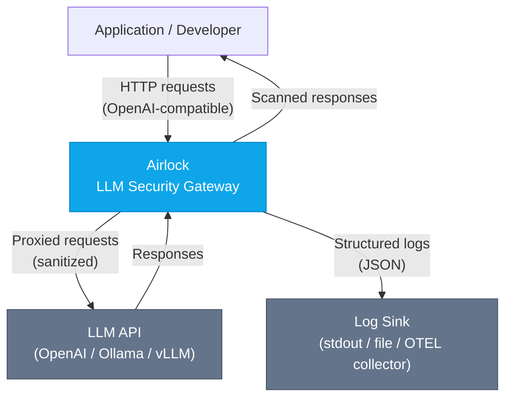
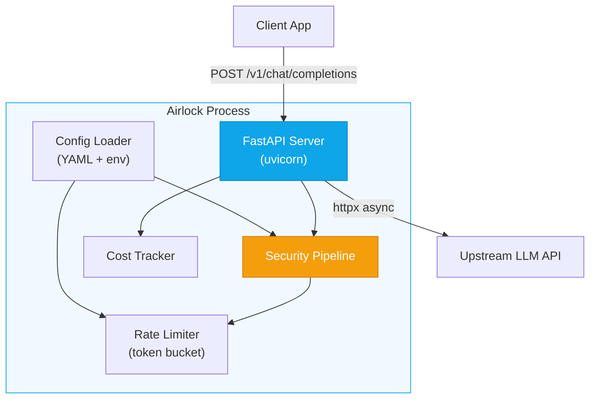
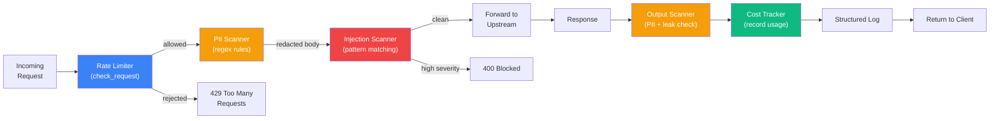
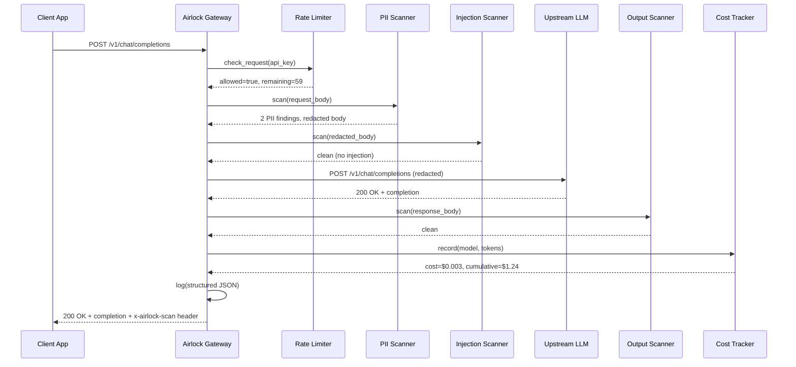

# Airlock Architecture

## Overview

Airlock is a security-focused reverse proxy for LLM APIs. It intercepts every request and response, applying a pipeline of security scans, rate limiting, and cost tracking before forwarding traffic to the upstream LLM provider.

## C4 Diagrams

### Level 1: System Context

### Level 2: Container Diagram

### Level 3: Component Diagram — Security Pipeline

### Main Sequence Diagram

## Design Decisions & Tradeoffs

### 1. Regex-Based Detection vs. ML Models

**Chose:** Regex pattern matching for PII and prompt injection detection.

**Why:**
- Zero additional latency (sub-millisecond per scan)
- No model dependencies or GPU requirements
- Predictable behavior — rules are auditable
- Easy to extend via configuration

**Tradeoff:** Higher false negative rate for novel attacks compared to ML-based detection. Airlock is designed as a fast first layer; organizations needing ML-based detection can add it as a plugin (roadmap).

### 2. In-Memory Rate Limiting vs. External Store

**Chose:** In-memory token bucket per process.

**Why:**
- Zero external dependencies
- Simple deployment (single binary/process)
- Sufficient for single-instance deployments

**Tradeoff:** Rate limits are per-process, not shared across instances. For horizontal scaling, a Redis-backed limiter is on the roadmap.

### 3. Synchronous Scanning vs. Async Pipeline

**Chose:** Synchronous scanning in the request path (scan → proxy → scan).

**Why:**
- Ensures no unscanned traffic reaches upstream
- Simplifies reasoning about security guarantees
- Scan latency is negligible for regex-based rules

**Tradeoff:** Adds ~1-2ms per request. For ML-based scanning, async/parallel scanning would be necessary.

### 4. Full Response Buffering vs. Streaming

**Chose:** Full response buffering before scanning.

**Why:**
- Required for response scanning (can't scan a partial response)
- Enables accurate token counting for cost tracking

**Tradeoff:** Adds latency for streaming use cases. Streaming passthrough (without response scanning) is on the roadmap.

## Scalability

| Dimension | Current (v0.1) | Planned |
|-----------|---------------|---------|
| Concurrency | Async (uvicorn workers) | Same |
| Rate limiting | In-memory, per-process | Redis-backed, shared |
| Scanning | Regex, ~1ms/request | + Optional ML scanner |
| Deployment | Single process | Docker + K8s manifests |
| Config | YAML file | + API for runtime updates |

## Failure Modes

| Failure | Behavior | Mitigation |
|---------|----------|------------|
| Upstream timeout | Returns 504 to client | Configurable timeout, retries |
| Upstream unreachable | Returns 502 to client | Health check endpoint |
| Config parse error | Fails to start, clear error message | `airlock check` validates config |
| OOM (large request) | Process crash | Request size limits (roadmap) |
| Rule regex invalid | Fails to compile at startup | Config validation on load |

## Extension Points

1. **Custom PII rules**: Add via YAML config
2. **Custom injection rules**: Add via YAML config
3. **Scanner plugins**: `OutputScanner` can be subclassed (roadmap: plugin registry)
4. **Cost model updates**: `CostTracker.MODEL_COSTS` dict can be extended
5. **Log exporters**: structlog processors can be swapped (OTEL exporter planned)

## Security Model

- Airlock itself does not store API keys — it forwards the client's `Authorization` header (or uses a configured upstream key)
- All scan findings are logged but PII matches are not stored in full — only rule name and position
- The gateway runs as an unprivileged process
- Demo mode never contacts external services
